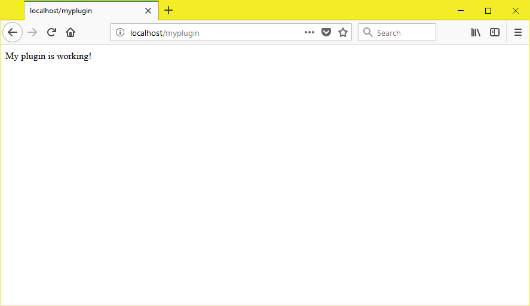

# Plugins

As of [`nozomi-core@1035bfe`](https://github.com/afroraydude/nozomi-core/commit/1035bfe32340768005afda7567080981eb2beac7) Nozomi has added plugin support. This allows for you to create custom processors and controllers for various routes using the new [`NozomiPlugin`](https://github.com/afroraydude/nozomi-core/blob/master/src/NozomiPlugin.php) class.

## First Plugin
First lets create our plugin. In your `index.php` file:

```php
class MyPlugin extends \Nozomi\Core\NozomiPlugin {

}
```

Now, let's override the `registerRoutes()` function with our own.

```php
public function registerRoutes() {
  
}
```

Currently our plugin doesn't do anything, lets change that with creating a new route. In your `registerRoutes()` function add this:

```php
$this->app->get('/myplugin', function (\Slim\Http\Request $request, \Slim\Http\Response $response, array $args) {
  return $response->getBody()->write("My plugin is working!");
});
```

Now, register the plugin with Nozomi and Slim.

```php
$pluginHandler = new \Nozomi\Core\NozomiPluginHandler();
$plugin = new TestPlugin($app);
$pluginHandler->registerPlugin($plugin);
$nozomi = new \Nozomi\Core\Nozomi($app, $pluginHandler);
```

Now we should see the plugin's route work.

